----

marp: true
math: katex
header: Fahradar | Embedded-Systems | Busch, Kiriakou, Koscheck, Müssig, Zissis
paginate: false
style: |
  pre {
    font-size: 12px;
  }
  code {
    font-size: 14px;
  }
  li, p, td, th {
    font-size: 20px;
  }
  ul {
    padding-left: 1em;
  }
  .columns {
    display: flex;
    gap: 1rem;
  }
  .columns > div {
    flex: 1 1 0;
  }
  .right-align {
    margin-right: 10px;
    text-align: right;
  }
  
----

# Fahradar
 
## *Sicher von A nach B*
 
Embedded Systems

Markus Busch, Chris Kiriakou, Michael Koscheck, Benedikt Müssig, Leonidas Zissis

<style scoped>
h1 {
    font-size: 80px;
    text-align: center;
    padding: 10px;
    margin: 10px;
}

h2 {
    font-size: 50px;
    text-align: center;
    padding: 10px;
    margin: 10px;
}

h3 {
    font-size: 30px;
    font-weight: normal;
    text-align: center;
    padding: 10px;
    margin: 10px;
}

section {
    text-align: center;
}

header {
    color: #FFFFFF00;
}
</style>

<!--
Noch offen
-->

----

# Einführung & Projektziel

Ziel: Fahrradfahrer\*innen sicher von A nach B bringen

> Fahrradfahrer\*in wird durch ein wahrnehmbares Signal aufmerksam auf potenzielle Gefahr gemacht. Und kann dadurch rechtzeit reagieren.

**Warnmethoden**
- Visuell: Kleines bei Gegenlicht ablesbares Sharp Memory Display am Lenker.
- Haptisch: Vibrationsmotor für diskrete Warnungen direkt am Griff.

<!--
Noch offen
-->

---- 
 
# Systemübersicht

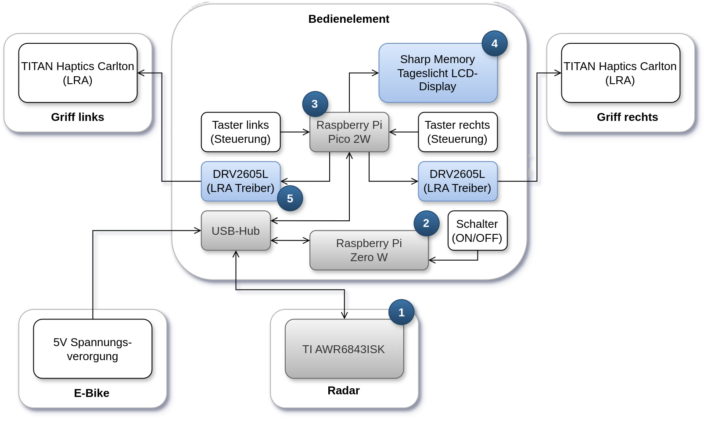

<style scoped>
p {
    text-align: center;
}
</style>

<!--
Noch offen
-->

----

# Grundprinzip Radar

Radar - **Ra**dio **D**etection **a**nd **R**anging

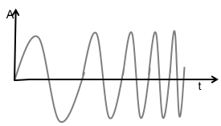

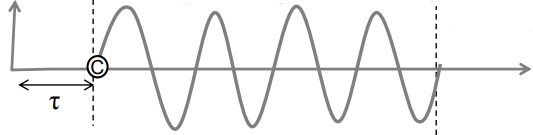

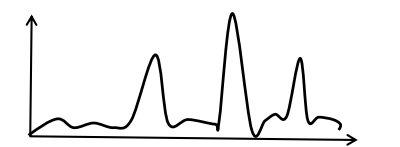

**Ablauf:**
1. **Senden**: Ausstrahlen eines Signals (Chirp)
2. **Reflexion & Empfangen**: Impuls/Echo wird teils zurückgestreut & empfangen
3. **Auswerten**: Peaks zu Objekten mit x,y,(z) und Geschwindigkeit

**Distanz**: Zeit bis Empfangen des Echos
**Geschwindigkeit**: Versatz der Phase zwischen 2 Chirps
**Azimuth**: Versatz der Phase zwischen 2 Antennen

----

# Aufbau eines Radars - Unser Radar

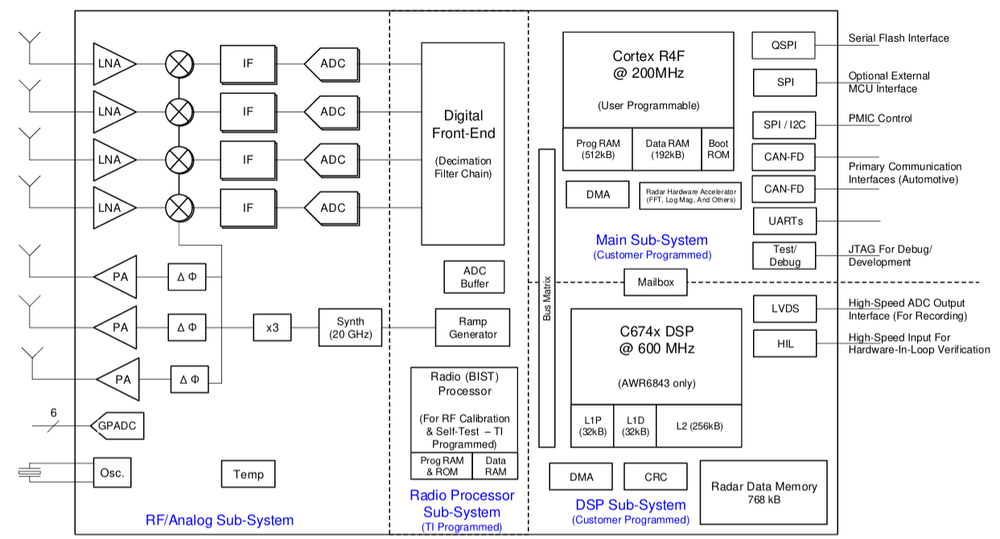

----

# Allgemeine Berechnungen

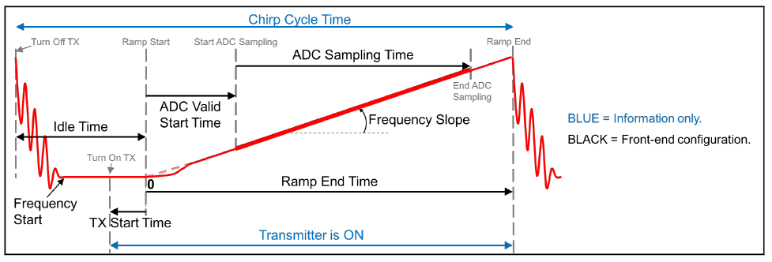

| Ziel       | $S$ | $f_s$ | $N_{samples}$ | $N_{chirps}$ | $T_{ramp}$ | $T_{idle}$ | $T_{ADC Start}$ | $B$ |
|------------|-----|-------|---------------|--------------|------------|------------|-----------------|-----|
| $d_{max}$  | ↓   | ↑     |               |              |            |            |                 |     |
| $v_{max}$  | ↓   | ↑     | ↓             |              | ↓          | ↓          | ↓               | ↓   |
| $\Delta d$ | ↑   | ↓     | ↑             |              |            |            |                 |     |
| $\Delta v$ |     |       |               | ↑            | ↑          | ↑          |                 | ↑   |

----

# Techniken aufgrund Anforderungen
- **Advanced Subframes** mit Bursts
  - **Beamforming**: Erzeugung Beam durch konstruktiver Interferenz mehrer Antennen
  - Schmal wegen destruktiver Interferenz
    - **Beamsteering**: gezielte Ausrichtung des Radarbeams durch Phasenverschiebung
- **MIMO** (Multiple Input Multiple Output): mehrere Sende- und Empfangsantennen für bessere Auflösung
- **CFAR** (Constant False Alarm Rate): automatische Schwellenwertanpassung zur Objekterkennung
- **Tracker**: Objektpersistenz und Punktwolken-Gruppierungen
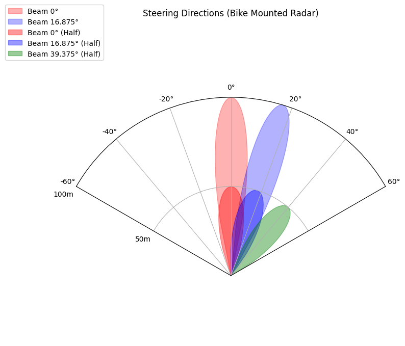

<!--
TI AWR6843ISK - Michael
-->

----

# Datenverarbeitung & Aufbereitung

<!--
Raspberry Pi Zero W - Benedikt
-->

----
 

# Firmware - Raspberry Pi Pico 2 W
<!--
Rasbperry Pi Pico 2 W - Leo
-->

**Zentrale Steuereinheit des Systems**

- Empfängt aufbereitete Radar-Daten über USB
- Kein Radar-Processing → reine Koordination
- Verteilt Daten an Ausgabegeräte (Display & Haptik)

**Datenfluss:**
```
Radar → Verarbeitung → USB → Pi Pico → Ausgabegeräte
```

<!--
Leo - 2.5 Min Firmware Präsentation
-->

----

# Software-Architektur

<div class="columns">
<div>

**Hauptschleife:**
```c
while(1) {
    usbcom_routine();        // USB-Daten empfangen
    gui_routine();           // An Display weiterleiten
    if (objects > 0) {
        haptics_routine();   // An Haptik weiterleiten
    }
}
```

**Empfangene Objektdaten:**
```c
typedef struct {
    float y;         // Entfernung [m]
    float x[2];      // Position [m] 
    float speed;     // Geschwindigkeit
    uint32_t id;     // Eindeutige ID
} object_t;
```

</div>
<div>

**Modulare Firmware:**
- `controller.c` - Koordinator
- `usbcom.c` - USB-Kommunikation
- `gui.c` - Display-Interface
- `haptics.c` - Haptik-Interface

**Performance:**
- 10 Hz Update-Rate
- Non-blocking USB
- Echtzeit-Datenverteilung

</div>
</div>

----

# Technische Umsetzung

**USB-Kommunikation:**
- Meldet sich als serielles CDC-Gerät an
- Parst eingehende Objektlisten
- Non-blocking für Echtzeit-Performance

**Datenverarbeitung:**
- Nimmt komplette Objektliste entgegen
- Leitet alle Objekte an Display weiter
- Wählt nächstes Objekt für Haptik aus

**Modulares Design:**
- Klare Trennung der Verantwortlichkeiten
- Einfache Erweiterung um neue Ausgabegeräte
- Wartbarer, strukturierter Code

**→ Effizienter Koordinator zwischen Radar-System und Benutzer-Interface**

----

# Visuelle Darstellung 

<!--
MemLCD - Markus
-->

----

# Haptik ─ DRV2605L & Titan-Haptics Carlton

<div class="columns">
<div>

- Haptischer Feedback Treiber für LRA & ERM
- Implementierung einer Bibliothek für Abstraktion der Low-Level-Funktionen

```c
typedef struct {
    uint8_t addr;                    // I2C address
    i2c_inst_t *drv_i2c_instance;    // Pointer to the Pico SDK I2C instance
    enum DRV2605L_MODE mode;         // Current mode (rtp/wave sequence)
    enum CTRL_MODE ctrl;             // Control strategy (open/closed-loop)
} drv2605l_t;

bool drv2605l_init(drv2605l_t *drv);
void drv2605l_write(drv2605l_t *drv, uint8_t reg, uint8_t val);
void drv2605l_set_mode(drv2605l_t *drv, enum DRV2605L_MODE mode);
void drv2605l_stop(drv2605l_t *drv);
void drv2605l_rtp(drv2605l_t *drv, uint8_t rtp);
```

`bool drv2605l_init(drv2605l_t *drv)`

- Kalibrierungsfunktion für Closed-Loop (Autocalibration-Routine schlägt fehl!)
- Frequenzbereiche **nicht** optimal! (150Hz - 300Hz)
- Setupfunktion für Open-Loop: $f_{min}$ = 80Hz

</div>
<div>

- LRA mit Beschleunigung von 5G bei 80Hz
- Betriebsspannung: 3.6 bis 10 Vp-p

| Modus       | Beschreibung                            |
|-------------|-----------------------------------------|
| Impact      | Mechanischer Schlag auf eine Oberfläche |
| Traditional | "Puls" haptisches Feedback, geräuschlos |

- **Haptisches Feedback**: (Rechteck $>$ Sinus)
- Mechanorezeptoren reagieren auf **starke** Veränderungen<sup>[1]</sup>:

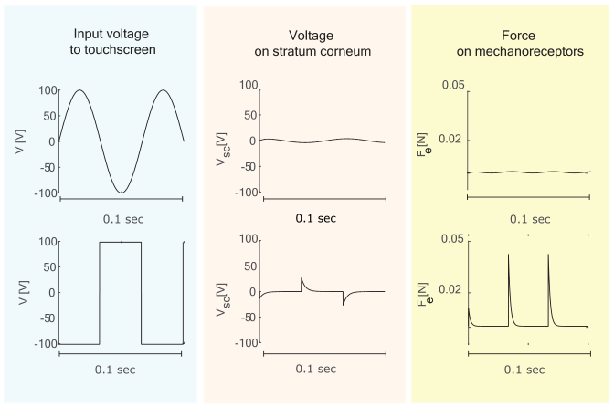

</div>
</div>


<style scoped>
p {
    text-align: center;
}
</style>

----

# Haptik ─ Wellengenerierung

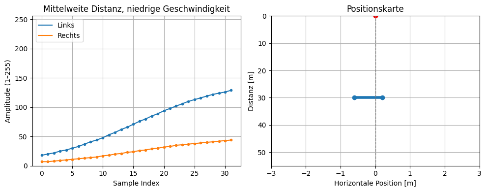
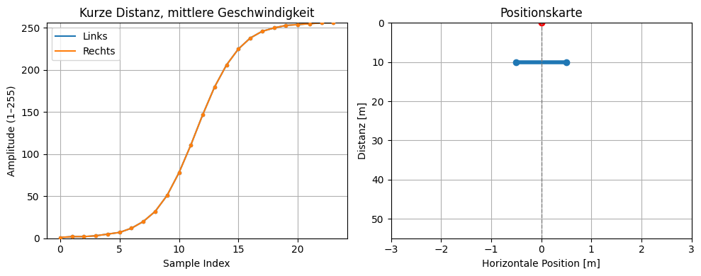
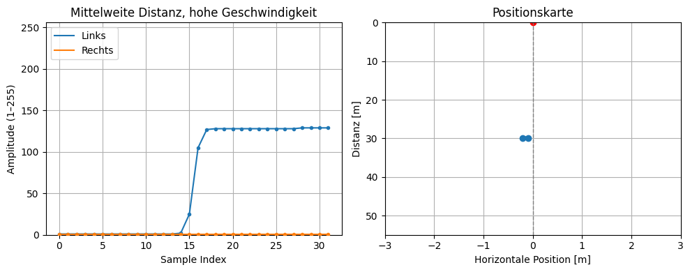

```c
void generate_waveform(float x[2], float y, float speed, waveform_t *waveform_out);
```

**Abhängikeit der Eingabeparameter**:
  - Boundingbox $[m]$ `x` $\mapsto$ Amplitudenfaktor jeweiliger Seite:
      - `x[0]`: Linke Grenze
      - `x[1]`: Rechte Grenze
  - Abstand $[m]$ `y` $\mapsto$ Amplitude, Anzahl der Sample (20 - 40)
  - Geschwindigkeit $[km/h]$ `speed` $\mapsto$ Steigung

**Modifikation der Sigmoidfunktion (Logistische Funktion)**:

$\sigma(x) = \frac{1}{1 + e^{-x}}$ $\longrightarrow$ $\sigma(t;k) = \frac{1}{1 + e^{-k(t-0.5)}}$

```c
for (int i = 0; i < sample_count; i++) {
    float time = (float)i / (sample_count - 1);             // normalize time [0, 1]
    float slope = 1.0f / (1.0f + expf(-k * (time - 0.5f))); // sigmoid function
    float left = left_factor * slope;
    float right = right_factor * slope;
    ...
}
```

<style scoped>
h1 {
    font-size: 35px;
</style>

<!--
DRV2605L & Titan-Haptics TacHommer-Carlton - Chris
-->

----

# Demo


<style scoped>
h1 {
    font-size: 80px;
    text-align: center;
    padding: 10px;
    margin: 10px;
}
</style>
 
<!--
Benedikt
-->

----

# Quellen

- [1] Y. Vardar, B. Güçlü and C. Basdogan, "Effect of Waveform on Tactile Perception by Electrovibration Displayed on Touch Screens," in IEEE Transactions on Haptics, vol. 10, no. 4, pp. 488-499, 1 Oct.-Dec. 2017, doi: 10.1109/TOH.2017.2704603.
- TI: AWR6843ISK Data Sheet, SWRU546E (2018, REV. 2022)
- TI: AWR6843 User Guide, SWRS248E (2020, REV. 2025)
- TI: MMWAVE SDK User Guide (3.6 LTS, 2021)
- TI: Introduction to mmwave Sensing: FMCW Radars
- TI: Beamforming in LRPD
- TI: mmWave Radar Interface Control
- TI: Long Range People Detection User Guide
- TI: People Counting CUstomization User Guide
- TI: Digital Baseband Architecture in AWR1xxx Devices
- TI: Object Detection Data-path Processing Chain (DPC)
- TI: Using a complex-baseband architecture in FMCW  radar systems, SPYY007 (Karthik Ramasubramanian)
- TI: Programming Chirp Parameters in TI Radar Devices, SWRA553A (2017, REV. 2020)
- G. Brooker, “Understanding Millimetre Wave FMCW Radars,” 1st International Conference On Sensing Technology, November 2005, New Zealand

# Tools

- TI Demo Visualizer
- TI Industrial Visualizer
- TI mmWave Sensing Estimator

<!--
Bitte fehlende Quellen hinzufügen
-->
 
<style scoped>
p, li {
    font-size: 14px;
}
h1 {
    font-size: 25px;
}
</style>
